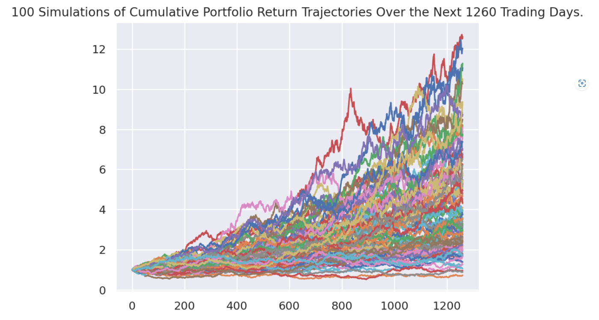

# Interactive Correlation Analyzer

[Interactive Correlation Analyzer App](https://derickdecesare-interactive-correlation-ana-streamlit-app-i90gio.streamlitapp.com/)

### De-Risk Your Portfolio With Uncorrelated Assets

Ray Dalio states that "With fifteen to twenty good, uncorrelated return streams, you can dramatically reduce your risks without reducing your expected returns". Therefore, finding un-correlated assets (i.e., Prices move independently of each other) is paramount for creating an great portfolio. After the 2020 pandemic, however, correlations across sectors have increased substantialy, making uncorrelated assets increasingly difficult to find. 

Our Interactive Correlation Analyzer helps solve this problem by allowing users to visualize correlations across market sectors and time horizons and to perform risk/reward analysis on different asset combinations.


## Usage
You can use the streamlit web application @ https://derickdecesare-interactive-correlation-ana-streamlit-app-i90gio.streamlitapp.com/

To run this application locally, after cloning the repo and installing the dependencies, navigate to the application folder and type "streamlit run streamlit_app.py".  The application will open a new window in your default web browser.

### Initial Page

When first opening the application you will be greeted with a page with a sidebar box that prompts you to select the desired industries you'd wish to analyze. Shown below.


### Head to Head Comparison
If you select two industries it will populate a head to head comparison, showing multiple charts including: Counts of Correlated Periods, Correlation Over Time, Beta of Selected Sectors, and Sharpe Ratios.


*note streamlit has an open bug out for the x axis of charts - hence why they are impossible to read. You can change the Date Range in the sidebar to make it more legible if needed.

### Multi-Sector Comparison
If you select three or more industries it will populate a multi-sector comparison, which includes, Sector Correlation Heatmap, Sector Volatility, Beta of Selected Sectors, and Sharpe Ratios.


### Mckenzie Test
Scroll down on the side bad and click on the McKenzie Test dropdown. You can then type in any ticker (any ticker available on yahoo fiance). This will compare the ticker you typed in to the index approximations of your current sector selections. After executing the analysis it will tell you whether adding that ticker to your approximated portfolio will increase your risk/return ratio.

Below it shows adding pton to a portfolio of S&P 500 ETF, Bitcoin, and Gold ETF would not pass the McKenzie test.


### Monte Carlo

Click on the Monte Carlo dropdown in the sidebar and select the number of years and weights for the different sectors you have selected. Then click the button that says "Run Monte Carlo". that will initiate the execution of the algorithm - be patient it takes few seconds for the algorithm to go through all the iterations. 

Once finished you will see the results populate. Including the Simulations Visulized:




Confidence Intervals and Standard Deviation Chart


Histogram of Final Cumulative Returns


## Technologies
This project runs on python 3.7 and includes the following libraries and dependencies:

* Numpy
* Pandas 
* Matplotlib inline
* hvPlot
* Jupyter Notebook
* MCSimulations from MCForecastTools
* os
* requests
* json
* Alpaca_trade_api
* Yahoo finance api
* Seaborn
* plost
* sklearn
* datasets
* dotenv

---

## Installation Guide

To use the application you need to install the following dependencies.

```python
    pip install streamlit==1.5.0
    pip install pandas
    pip install plost
    pip install matplotlib
    pip install pathlib
    pip install hvplot
    pip install numpy
    pip install seaborn
    pip install datetime
    pip install requires.io
    pip install forecast-tools
    pip install urllib3
    pip install altair
    pip install python-time
    pip install alpaca-trade-api
    pip install python-dotenv
  
```
* Make sure to use hvPlot version 0.7.0 or later.

---

## Methodology ##

**Data Sources:**
* Y!Finance
* Alpaca API
* econDB

**Data Cleaning:**

* Finding and determining the missing values
* Finding and removing the duplicates
* Normalizing data

**Data Exploration:**

* Daily return
* Cumulative return
* Standard deviation
* Correlation
* Sharp ratio 
* Beta
* Mckenzie test
* Monte Carlo Simulation

**Data Visualization:**

* Seaborn
* Matplotlib
* Altair
* hvPlot


## CONCLUSION: ##

* Crypto currency use to be  uncorrelated with the market but now its very correlated with the market.
* Commodity and gold sector have remained uncorrelated and may be able to contribute a good cushion in the portfolio against risk.
* Energy sector is very promising as well in terms of correlation, volatility with low risk high return profile.


**What can be improved**

* Graphs that display x axis more effectivly.

* Add more analytics tools.

* Improve interactivity with the graphs.


## Contributers

Sterling Davis

David Lampach

Patrick Ball

Derick DeCesare 

Manisha Lal

(08/13/2022)

___


## License

copyright 2022
